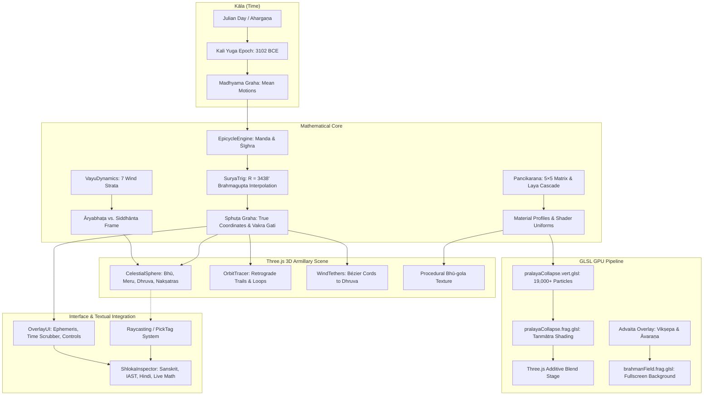

# सिद्धांत-यंत्र · Siddhānta-Yantra

> **A Classical Indian Cosmology, Sūrya-Siddhānta Epicyclic Computation & Advaita Vedānta Engine**  
> *Built with Three.js, Custom GLSL Shaders, TypeScript, and Vite*  
> *Created & conceptualized by [Soumya Verma](https://github.com/vermasoumya) using **Opus 5.5 High***

[](https://github.com/vermasoumya/siddhanta-yantra)
[](https://www.typescriptlang.org/)
[](https://threejs.org/)
[](https://www.khronos.org/webgl/)
[](https://vitejs.dev/)
[](https://en.wikipedia.org/wiki/Surya_Siddhanta)
[](https://en.wikipedia.org/wiki/Advaita_Vedanta)

---

```
                       ॐ
       अदृश्यरूपिणः काला भुवनेषु व्यवस्थिताः।
     शीघ्रमन्दोच्चपाताख्या ग्रहाणां गतिकारकाः॥
      तद्वातविशिखैर्बद्धास्तेऽपकृष्यन्त मूर्त्तयः।
    प्राक्पश्चादपकृष्यन्ते यथासन्नं स्वदिङ्मुखम्॥
             — सूर्यसिद्धान्त (२.१–२)
```

> *"Invisible forms of Time — known as śīghrocca, mandocca, and pāta — reside within the planetary spheres. Binding the planetary orbs with cords of cosmic wind, they pull them forward and backward toward their respective stations, producing swift, slow, and retrograde motions."*  
> — **Sūrya-Siddhānta (2.1–2)**

---

## 📑 Table of Contents

1. [Executive Vision & Overview](#1-executive-vision--overview)
2. [Architectural Overview & Data Flow](#2-architectural-overview--data-flow)
3. [Mathematical Core & Astronomical Engines](#3-mathematical-core--astronomical-engines)
   - [3.1 Sūrya-Siddhānta Trigonometry (`suryaTrig.ts`)](#31-sūrya-siddhānta-trigonometry-suryatrigts)
   - [3.2 Manda & Śīghra Epicycle Engine (`epicycleEngine.ts`)](#32-manda--śīghra-epicycle-engine-epicycleenginets)
   - [3.3 Pañcīkaraṇa Quintuplication Engine (`pancikarana.ts`)](#33-pañcīkaraṇa-quintuplication-engine-pancikaranats)
   - [3.4 The Seven Concentric Vāyu Strata (`vayuDynamics.ts`)](#34-the-seven-concentric-vāyu-strata-vayudynamicsts)
4. [Simulation & Visual Pipeline](#4-simulation--visual-pipeline)
   - [4.1 The Celestial Armillary Sphere (`CelestialSphere.ts`)](#41-the-celestial-armillary-sphere-celestialspherets)
   - [4.2 Authentic Orbit & Vakra Loop Tracing (`OrbitTracer.ts`)](#42-authentic-orbit--vakra-loop-tracing-orbittracerts)
   - [4.3 Dynamic Cosmic Wind Tethers (`WindTethers.ts`)](#43-dynamic-cosmic-wind-tethers-windtethersts)
   - [4.4 Prākṛtika Pralaya & Particle Dissolution (`PralayaEngine.ts`)](#44-prākṛtika-pralaya--particle-dissolution-pralayaenginets)
   - [4.5 Advaita Perspective & The Brahman Field (`AdvaitaOverlay.ts`)](#45-advaita-perspective--the-brahman-field-advaitaoverlayts)
5. [Custom GLSL Shaders](#5-custom-glsl-shaders)
   - [5.1 Brahman Field Fragment Shader (`brahmanField.frag.glsl`)](#51-brahman-field-fragment-shader-brahmanfieldfragglsl)
   - [5.2 Pralaya Collapse Shaders (`pralayaCollapse.vert.glsl` & `.frag.glsl`)](#52-pralaya-collapse-shaders-pralayacollapsevertglsl--fragglsl)
6. [Interactive UI & Textual Scholarship Tools](#6-interactive-ui--textual-scholarship-tools)
   - [6.1 Shloka & IAST Inspector (`ShlokaInspector.ts` & `iast.ts`)](#61-shloka--iast-inspector-shlokainspectorts--iastts)
   - [6.2 Glassmorphic HUD & Ephemeris Controls (`OverlayUI.ts`)](#62-glassmorphic-hud--ephemeris-controls-overlayuits)
7. [Cosmological Time Scales & Canonical Constants](#7-cosmological-time-scales--canonical-constants)
8. [Technology Stack](#8-technology-stack)
9. [Project Directory Layout](#9-project-directory-layout)
10. [Quick Start & Installation](#10-quick-start--installation)
11. [Textual Bibliography & Academic Citations](#11-textual-bibliography--academic-citations)

---

## 1. Executive Vision & Overview

**Siddhānta-Yantra (सिद्धांत-यंत्र)** is an academic-grade, visually stunning 3D astronomical and cosmological simulation that bridges classical Sanskrit astronomical treatises (*Sūrya Siddhānta*, *Āryabhaṭīya*, *Siddhānta Śiromaṇi*) and non-dual metaphysics (*Advaita Vedānta*, *Pañcadaśī*, *Vivekacūḍāmaṇi*) with modern WebGL rendering, custom GLSL shaders, and interactive HTML5 canvas technologies.

Unlike conventional planetarium software that relies on modern Keplerian osculating elements or empirical polynomial approximations (such as VSOP87), Siddhānta-Yantra computes planetary positions directly from the original mathematical algorithms formulated in classical India:

- **Strict Siddhāntic Trigonometry**: Computation using the canonical radius $R = 3438'$ (the *Trijyā*), 24 discrete tabular sine differences (*jyā-piṇḍas*), and Brahmagupta's 7th-century second-order difference interpolation (*Khaṇḍakhādyaka* 9.8). No planetary pipeline function calls modern `Math.sin`, `Math.cos`, or `Math.asin`.
- **Double Epicyclic Architecture**: Complete implementation of the variable *Manda* (apsidal) and *Śīghra* (conjunctional) epicycles with varying peripheries between even and odd quadrants, generating authentic retrograde loops (*vakra-gati*) and stationary points (*kuṭila*).
- **Cosmic Hydrodynamics**: Simulation of the seven concentric atmospheric and celestial wind strata (*Sapta-Vāyu-Mārga*) from the *Mahābhārata* and *Harivaṁśa*, complete with hydrodynamic drag, velocity vector fields ($\vec{v} = \vec{\omega} \times \vec{x}$), and Bézier wind tethers (*vāta-raśmi*) anchored to the pole-star *Dhruva*.
- **Kinematic Relativity**: Toggle between the **Āryabhaṭa frame** (where the spherical Earth rotates eastward on its axis beneath a resting celestial sphere) and the **Siddhānta frame** (where Earth is stationary and the cosmic wind *Parāvaha* sweeps the celestial dome westward), demonstrating Āryabhaṭa's classic boatman metaphor (*Āryabhaṭīya*, Golapāda 9).
- **Advaita Vedānta & Cosmogenesis**: An interactive ontological transition from the empirical world of differentiated forms (*Vyāvahārika Satya*) to the unmanifest, non-dual absolute (*Pāramārthika Satya*), alongside a 19,000+ particle simulation of cosmic dissolution (*Prākṛtika Pralaya*) according to *Śrīmad Bhāgavatam* (12.4) and the *Pañcīkaraṇa* matrix of *Pañcadaśī* (1.27).

---

## 2. Architectural Overview & Data Flow

The runtime loop links astronomical timekeeping, planetary kinematics, hydrodynamic winds, and real-time shader pipelines:



---

## 3. Mathematical Core & Astronomical Engines

### 3.1 Sūrya-Siddhānta Trigonometry (`suryaTrig.ts`)

In classical Indian astronomy, trigonometric functions are not defined on a unit circle ($R = 1$) in radians, but as lengths of arc-chords in a reference circle whose circumference measures $C = 360^\circ \times 60' = 21\,600'$ arcminutes. The radius (*Trijyā*) is:

$$R = \frac{21\,600'}{2\pi} \approx 3437.74677\dots' \xrightarrow{\text{canonical integer}} 3438'$$

The circle is partitioned into 96 equal quadrants of 24 steps each, yielding a fundamental tabular increment:

$$\Delta\theta = \frac{90^\circ}{24} = 3^\circ 45' = 225'$$

#### The 24 Tabular R-Sines (*Jyā-piṇḍa*)
The 24 tabular sine values ($J_0$ to $J_{24}$) codified in *Sūrya-Siddhānta* (2.15–22) are:

| Step $i$ | Angle $\theta$ | Jyā Value ($J_i$) | First Difference ($\Delta_i$) | Step $i$ | Angle $\theta$ | Jyā Value ($J_i$) | First Difference ($\Delta_i$) |
|:---:|:---:|:---:|:---:|:---:|:---:|:---:|:---:|
| **0** | $0^\circ 00'$ | **0** | — | **13** | $48^\circ 45'$ | **2585** | 154 |
| **1** | $3^\circ 45'$ | **225** | 225 | **14** | $52^\circ 30'$ | **2728** | 143 |
| **2** | $7^\circ 30'$ | **449** | 224 | **15** | $56^\circ 15'$ | **2859** | 131 |
| **3** | $11^\circ 15'$ | **671** | 222 | **16** | $60^\circ 00'$ | **2978** | 119 |
| **4** | $15^\circ 00'$ | **890** | 219 | **17** | $63^\circ 45'$ | **3084** | 106 |
| **5** | $18^\circ 45'$ | **1105** | 215 | **18** | $67^\circ 30'$ | **3177** | 93 |
| **6** | $22^\circ 30'$ | **1315** | 210 | **19** | $71^\circ 15'$ | **3256** | 79 |
| **7** | $26^\circ 15'$ | **1520** | 205 | **20** | $75^\circ 00'$ | **3321** | 65 |
| **8** | $30^\circ 00'$ | **1719** | 199 | **21** | $78^\circ 45'$ | **3372** | 51 |
| **9** | $33^\circ 45'$ | **1910** | 191 | **22** | $82^\circ 30'$ | **3409** | 37 |
| **10** | $37^\circ 30'$ | **2093** | 183 | **23** | $86^\circ 15'$ | **3431** | 22 |
| **11** | $41^\circ 15'$ | **2267** | 174 | **24** | $90^\circ 00'$ | **3438** | 7 |
| **12** | $45^\circ 00'$ | **2431** | 164 | — | — | — | — |

#### Brahmagupta's Second-Order Interpolation
For an intermediate angle $\theta \in [0^\circ, 90^\circ]$, let $u = \theta / 3.75^\circ$, $i = \lfloor u \rfloor$, and fractional remainder $f = u - i$. Rather than linear interpolation, Brahmagupta's quadratic formula (*Khaṇḍakhādyaka* 9.8) computes:

$$\Delta_{gata} = J_i - J_{i-1}, \quad \Delta_{bhogya} = J_{i+1} - J_i$$

$$\text{jyā}(\theta) = J_i + f \cdot \frac{\Delta_{gata} + \Delta_{bhogya}}{2} + f^2 \cdot \frac{\Delta_{bhogya} - \Delta_{gata}}{2}$$

The maximum deviation of this formulation across the entire quadrant against analytical $R\sin\theta$ is less than **$0.33'$ arcminutes**, preserving extreme fidelity to classical manual table lookups.

#### Inverse Sine and Angle Reconstruction
The inverse R-sine (`arcJya`) analytically inverts Brahmagupta's quadratic:

$$c \cdot f^2 + a \cdot f - d = 0 \quad \text{where } a = \frac{\Delta_{gata} + \Delta_{bhogya}}{2}, \quad c = \frac{\Delta_{bhogya} - \Delta_{gata}}{2}, \quad d = v - J_i$$

Using the numerically stable rationalised quadratic form $f = \frac{2d}{a + \sqrt{a^2 + 4cd}}$, precision is preserved without catastrophic cancellation. The angular arc function `capa(bhuja, koti)` replaces modern `atan2`.

---

### 3.2 Manda & Śīghra Epicycle Engine (`epicycleEngine.ts`)

The planetary theory of the *Sūrya-Siddhānta* accounts for non-uniform orbital speed (ellipticity) and synodic parallax (heliocentric orbital projection) using two concentric epicycles:

1. **Manda-saṁskāra** (*Equation of the Centre*): Corrects for orbital eccentricity and apsidal lag relative to the planet's slow-moving apogee (*mandocca*).
2. **Śīghra-saṁskāra** (*Equation of Conjunction / Parallax*): Corrects for the orbital motion of Earth relative to the Sun (*śīghrocca*).

#### Timekeeping: The Ahargaṇa
Planetary time is tracked in **Ahargaṇa** (अहर्गण) — the count of civil (*sāvana*) days elapsed since the epoch of Kali Yuga:

$$\text{Epoch: Midnight at Laṅkā (Prime Meridian), 17/18 February 3102 BCE} \quad (JD = 588\,465.5)$$

Mean longitudes (*madhyama graha*) accumulate linearly:

$$\lambda_{mean} = \text{fract}\left(\text{Revolutions}_{\text{epoch}} + \frac{\text{Revolutions} \times \text{Ahargaṇa}}{1\,577\,917\,828}\right) \times 360^\circ$$

#### Variable Epicycle Peripheries
Epicycles contract and dilate as a function of the anomaly (*kendra* $\theta$), defined by their even-quadrant ($p_{even}$ at $0^\circ, 180^\circ$) and odd-quadrant ($p_{odd}$ at $90^\circ, 270^\circ$) circumferences:

$$p(\theta) = p_{even} - \left(p_{even} - p_{odd}\right) \cdot \frac{|\text{jyā}(\theta)|}{R}$$

The radius of the epicycle (*antyaphala*) on the $R = 3438'$ scale is:

$$r_{epicycle} = \frac{p(\theta)}{360^\circ} \cdot R$$

#### The Canonical Four-Step Saṁskāra for Star-Planets
For the five star-planets (*tārā-grahas*: Mars, Mercury, Jupiter, Venus, Saturn), *Sūrya-Siddhānta* (2.43–45) dictates a subtle four-step iterative correction:

```
  Mean Planet (madhyama)
          │
          ▼
  [Step 1] Apply ½ Śīghra correction (anomaly = śīghrocca - mean)
          │
          ▼
  [Step 2] Apply ½ Manda correction (anomaly = intermediate - mandocca)
          │
          ▼
  [Step 3] Apply Full Manda correction to the original mean planet
          │
          ▼
  Manda-Sphuṭa (true-mean planet)
          │
          ▼
  [Step 4] Apply Full Śīghra correction (anomaly = śīghrocca - manda-sphuṭa)
          │
          ▼
  Sphuṭa Graha (True Geocentric Longitude)
```

1. **Step 1**: Anomaly $\kappa_1 = \theta_{\text{śīghrocca}} - \theta_{\text{mean}}$. Calculate $\Delta_1$ via Śīghra. Update $\theta_1 = \theta_{\text{mean}} + \frac{1}{2}\Delta_1$.
2. **Step 2**: Anomaly $\kappa_2 = \theta_1 - \theta_{\text{mandocca}}$. Calculate $\Delta_2$ via Manda. Update $\theta_2 = \theta_1 + \frac{1}{2}\Delta_2$.
3. **Step 3**: Anomaly $\kappa_3 = \theta_2 - \theta_{\text{mandocca}}$. Calculate full Manda correction $\Delta_3$. Apply to original mean: $\theta_{\text{manda-sphuṭa}} = \theta_{\text{mean}} + \Delta_3$.
4. **Step 4**: Anomaly $\kappa_4 = \theta_{\text{śīghrocca}} - \theta_{\text{manda-sphuṭa}}$. Compute full Śīghra correction $\Delta_4$ via the hypotenuse (*karṇa*):
   
   $$\text{karṇa} = \sqrt{(R + \text{koṭiphala})^2 + (\text{bhujāphala})^2}$$
   
   $$\text{True Longitude } \lambda_{\text{sphuṭa}} = \theta_{\text{manda-sphuṭa}} + \Delta_4$$

#### Planetary Latitude (*Vikṣepa*)
Planetary latitude $\beta$ is computed via the orbital node (*pāta*, which regresses westward) reduced by the variable distance hypotenuse (*śīghra-karṇa*):

$$\beta = \frac{\beta_{\text{max}} \cdot \text{jyā}(\theta_{\text{arg}} - \theta_{\text{pāta}})}{\text{karṇa}_{\text{śīghra}}}$$

#### The Eight-Fold Classification of Planetary Motion (*Aṣṭadhā Gati*)
*Sūrya-Siddhānta* (2.12) categorises planetary velocity into eight distinct dynamic states:

```
वक्रानुवक्रा कुटिला मन्दा मन्दतरा समा। तथा शीघ्रतरा शीघ्रा ग्रहाणामष्टधा गतिः॥
```

1. **Vakra (वक्र)**: Retrograde motion, deepening ($d\lambda/dt < 0, d^2\lambda/dt^2 < 0$).
2. **Anuvakra (अनुवक्र)**: Retrograde motion, slackening toward station ($d\lambda/dt < 0, d^2\lambda/dt^2 > 0$).
3. **Kuṭila (कुटिल)**: Stationary point ($|d\lambda/dt| \approx 0$).
4. **Mandatara (मन्दतर)**: Very slow direct motion ($< 50\%$ of mean speed).
5. **Manda (मन्द)**: Slow direct motion ($50\% - 95\%$ of mean speed).
6. **Sama (सम)**: Mean motion ($\approx 100\%$ of mean daily speed).
7. **Śīghra (शीघ्र)**: Swift direct motion ($105\% - 150\%$ of mean speed).
8. **Śīghratara (शीघ्रतर)**: Extremely swift direct motion ($> 150\%$ of mean speed).

---

### 3.3 Pañcīkaraṇa Quintuplication Engine (`pancikarana.ts`)

In Advaita Vedānta (*Pañcadaśī* 1.27 and Ādi Śaṅkarācārya's *Pañcīkaraṇam*), the five primordial subtle elements (*sūkṣma-bhūtas* or *tanmātras*) transform into gross perceptible matter (*sthūla-bhūtas*) through systematic division:

```
द्विधा विधाय चैकैकं चतुर्धा प्रथमं पुनः।
स्वस्वेतरद्वितीयांशैर्योजनात्पञ्च पञ्च ते॥
```

1. Each subtle element is halved ($50\% / 50\%$).
2. One half is retained as its own subtle essence (*svāṁśa* = $0.5$).
3. The other half is subdivided into four equal eighths ($12.5\%$ each) and distributed among the remaining four elements (*parāṁśa* = $0.125$).

$$\mathbf{M} = \begin{pmatrix}
0.500 & 0.125 & 0.125 & 0.125 & 0.125 \\
0.125 & 0.500 & 0.125 & 0.125 & 0.125 \\
0.125 & 0.125 & 0.500 & 0.125 & 0.125 \\
0.125 & 0.125 & 0.125 & 0.500 & 0.125 \\
0.125 & 0.125 & 0.125 & 0.125 & 0.500
\end{pmatrix} = 0.375\,\mathbf{I} + 0.125\,\mathbf{J}$$

Where $\mathbf{J}$ is the $5 \times 5$ matrix of all ones. The eigenvalues are $\lambda_1 = 1.0$ (conservation of substance) and $\lambda_{2,3,4,5} = 0.375$. The closed-form analytical inverse used for cosmological unravelling (*apañcīkaraṇa* / *laya-cintana*) is:

$$\mathbf{M}^{-1} = \frac{8}{3}\left(\mathbf{I} - \frac{1}{8}\mathbf{J}\right) \implies \text{Diagonal} = \frac{7}{3}, \quad \text{Off-diagonal} = -\frac{1}{3}$$

#### Subtle Element Properties (*Sūkṣma Guṇas*)
Each tattva possesses intrinsic physical and visual characteristics:

| Tattva | Tanmātra | Perceptible Guṇas | Traditional Varṇa | Density | Albedo | Emissive | Fluidity | Opacity |
|:---|:---|:---:|:---|:---:|:---:|:---:|:---:|:---:|
| **Ākāśa (आकाश)** | Śabda (Sound) | 1 | Deep Indigo (`#1f1a6b`) | 0.00 | 0.04 | 0.00 | 1.00 | 0.00 |
| **Vāyu (वायु)** | Sparśa (Touch) | 2 | Smoke Grey (`#8c99a8`) | 0.08 | 0.32 | 0.00 | 0.95 | 0.12 |
| **Tejas (तेजस्)** | Rūpa (Form) | 3 | Red-Flame (`#ff5214`) | 0.22 | 0.85 | 1.00 | 0.75 | 0.55 |
| **Āpas (आपः)** | Rasa (Taste) | 4 | Pearl Aqua (`#d1ebfa`) | 0.62 | 0.50 | 0.00 | 0.85 | 0.50 |
| **Pṛthvī (पृथ्वी)** | Gandha (Smell) | 5 | Golden Ochre (`#dba833`) | 1.00 | 0.30 | 0.00 | 0.00 | 1.00 |

Gross planetary materials blend these properties according to their composition vectors $\vec{w} = \mathbf{M} \vec{s}$, supplying real-time parameters directly to GLSL uniforms (`uDensity`, `uAlbedo`, `uEmissive`, `uFluidity`, `uOpacity`, `uSpecular`).

---

### 3.4 The Seven Concentric Vāyu Strata (`vayuDynamics.ts`)

Cosmic rotation is maintained by seven concentric spherical shells of wind (*Sapta-Vāyu-Mārga*) radiating outward from the Earth to the pole star *Dhruva* (*Mahābhārata*, Śānti Parva / *Harivaṁśa*):

$$\vec{v}_i(\vec{x}) = \vec{\omega}_i \times \vec{x}$$

$$\vec{\omega}_i = \hat{\omega}_{\text{dhruva}} \cdot \left(\Omega_{i,\text{intrinsic}} - \delta_{\text{mode}} \cdot \omega_{\text{diurnal}}\right)$$

$$\vec{a}_{\text{drag}} = k_i \cdot \left(\vec{v}_i - \vec{v}_{\text{particle}}\right)$$

| Strata Index | Vāyu Name | Cosmic Domain | Dynamic Function | Governing Bodies |
|:---:|:---|:---|:---|:---|
| **1** | **Āvaha (आवह)** | Surface to Cloud Realm | Co-rotates with Earth's crust | Clouds, rain, winds |
| **2** | **Pravaha (प्रवह)** | Upper Atmosphere | Fast diurnal carrier gales | Meteors, atmospheric flight |
| **3** | **Udvaha (उद्वह)** | Lunar Stratum | Governs lunar motion & oceanic tides | Candra (Moon) |
| **4** | **Saṁvaha (संवह)** | Solar Stratum | Directs the annual solar revolution | Sūrya (Sun) |
| **5** | **Vivaha (विवह)** | Planetary Realm | Regulates orbital periods of star-planets | Budha, Śukra, Maṅgala, Guru, Śani |
| **6** | **Parivaha (परिवह)** | Stellar Stratum | Keeps fixed stellar coordinates | 27 Nakṣatras, Saptarṣi |
| **7** | **Parāvaha (परावह)** | Outermost Cosmic Vortex | The supreme vortex anchored to Dhruva | Whirls the entire celestial sphere |

#### Diurnal Motion Relativity: Āryabhaṭa vs. Siddhānta
The engine models the kinematic equivalence articulated by Āryabhaṭa (*Āryabhaṭīya*, Golapāda 9):

```
अनुलोमगतिर्नौस्थः पश्यत्यचलं विलोमगं यद्वत्।
अचलानि भानि तद्वत् समपश्चिमगानि लङ्कायाम्॥
```

- **Āryabhaṭa Mode ($\delta_{\text{mode}} = 0$)**: The Earth (*Bhū-gola*) spins eastward around the Dhruva axis with diurnal speed $\omega_d = 360.9856^\circ / \text{day}$; the star-sphere (*bhacakra*) is at rest.
- **Siddhānta Mode ($\delta_{\text{mode}} = 1$)**: The Earth is stationary ($\omega_{\text{bhū}} = 0$); the outer wind *Parāvaha* sweeps the entire celestial sphere westward at $-\omega_d$.
- **Invariance**: Observed relative velocity $\vec{\omega}_{\text{stratum}} - \vec{\omega}_{\text{bhū}} = -\omega_d$ is mathematically identical in both coordinate systems.

#### Bhāskara's Gravitational Model (*Ākṛṣṭi-Śakti*)
Gravitational acceleration toward the unsupported Earth (*nirādhāra pṛthvī*) is implemented directly from *Siddhānta Śiromaṇi* (Bhuvanakośa 4, 6):

$$\vec{F}_{\text{grav}} = -\frac{G_s \cdot M_{\text{bhū}}}{r^2} \hat{r}$$

Every direction outward from Earth is defined as *ūrdhva* (up), and every direction inward toward the centre of the terrestrial globe is defined as *adhaḥ* (down).

---

## 4. Simulation & Visual Pipeline

### 4.1 The Celestial Armillary Sphere (`CelestialSphere.ts`)

The 3D armillary environment comprises:
- **Bhū-gola (Earth)**: A textured sphere with procedurally synthesized land and oceans whose colors derive from the Pañcīkaraṇa profiles of Pṛthvī and Āpas.
- **Meru & Vaḍavāmukha**: The golden peak of Mount Meru (*Sumeru*) at the North Pole and the submarine fire of *Vaḍavāmukha* at the South Pole.
- **Four Equatorial Cities**: Laṅkā ($0^\circ$), Yamakoṭi ($90^\circ\text{E}$), Siddhapura ($180^\circ$), and Romaka ($90^\circ\text{W}$).
- **Meru-daṇḍa**: The golden central axis connecting Earth's poles to the celestial north pole star *Dhruva*.
- **The Bhacakra (Star-Wheel)**:
  - **27 Nakṣatras**: Placed at their canonical ecliptic longitudes ($\lambda = k \cdot 13^\circ 20'$) with individual yogatārā star designations and devatā markers.
  - **Saptarṣi**: The constellation of Ursa Major (Kratu, Pulaha, Pulastya, Atri, Aṅgiras, Vasiṣṭha, Marīci).
  - **Ecliptic Band**: The 12 Rāśis (Meṣa to Mīna) with coordinate indicators and obliquity of $24^\circ$ (*parama-apakrama*).
  - **Parāvaha Vortex**: Volumetric rotating particle streamers swirling about the Dhruva axis.

### 4.2 Authentic Orbit & Vakra Loop Tracing (`OrbitTracer.ts`)

Planetary paths are traced in real time using a dynamic circular buffer parented to the *bhacakra* frame. Unlike naive coordinate systems where the diurnal rotation smears orbital paths into unreadable spirals, the bhacakra-aligned trace isolates synodic motion:
- **Direct Motion (*Mārgī*)**: Traced in the planet's signature elemental hue with exponential luminosity decay over time.
- **Retrograde Loops (*Vakra*)**: Automatically detects $d\lambda / dt < 0$ and highlights the looping retrograde arc in vivid magenta (`#ff4f9a`).
- **Kuṭila Points**: Identifies stationary stations (*vakrārambha* and *mārgārambha*) with bisection convergence.

### 4.3 Dynamic Cosmic Wind Tethers (`WindTethers.ts`)

Visualizes the classical doctrine (*Sūrya-Siddhānta* 2.2) that planets are tethered to the pole-star by cords of wind (*vāta-raśmi*):
- Each planet is linked to Dhruva via a dynamic 3D cubic Bézier curve.
- **Tension ($\tau$)**: Computes aerodynamic strain as a function of the local Vāyu stratum's velocity: $\tau = \frac{|\omega|}{|\omega| + \omega_0}$.
- **Catenary Sag ($s$)**: Cords droop toward Earth when slack ($\tau \to 0$).
- **Vortex Sweep ($w$)**: The cosmic wind pulls the cord sideways in the direction of the rotating stream.
- **Prāṇa Pulses**: Luminous energy packets travel down the cord from Dhruva to the planet, increasing in frequency with higher tension.

### 4.4 Prākṛtika Pralaya & Particle Dissolution (`PralayaEngine.ts`)

Implements the five-stage universal dissolution (*Prākṛtika Pralaya*) from *Śrīmad Bhāgavatam* (12.4) and *Mahābhārata* (Śānti Parva 231–233). A unified parameter $L \in [0, 5]$ governs the transition:

$$0 \ (\text{Sṛṣṭi: Manifest}) \longrightarrow 1 \ (\text{Earth melts into Water}) \longrightarrow 2 \ (\text{Water evaporates into Fire}) \longrightarrow 3 \ (\text{Fire quelled by Wind}) \longrightarrow 4 \ (\text{Wind rests in Space}) \longrightarrow 5 \ (\text{Space resolves into Avyakta})$$

The simulation controls **19,000+ GPU particles**:
- **Nitya Pralaya**: Micro-dissolution with continuous birth, decay, and regeneration lifetimes.
- **Naimittika Pralaya**: The cosmic deluge (*kalpānta-kāla*) flooding the three lower worlds (*trilokī*).
- **Ātyantika Pralaya**: Total metaphysical dissolution (*Māyā-nivṛtti*) through philosophical liberation (*jñāna*).

### 4.5 Advaita Perspective & The Brahman Field (`AdvaitaOverlay.ts`)

Provides the user with a philosophical perspective toggle based on Śaṅkarācārya's *Vivekacūḍāmaṇi*:
- **Vyāvahārika Mode (Empirical Reality)**: Projection (*vikṣepa* = 1) and veiling (*āvaraṇa* = 1) active. The planets, epicycles, nakṣatras, and wind strata appear as an intricate mechanical manifold.
- **Pāramārthika Mode (Absolute Reality)**: The projection is withdrawn (*vikṣepa* $\to$ 0), mechanical constructs fade, the veil lifts (*āvaraṇa* $\to$ 0), and the visual scene dissolves into an isotropic, self-luminous scalar field of pure consciousness ($B(\hat{\omega})$).
- **Camera Standpoint Dissolution**: As the ego-centric observer dissolves, the camera's field of view gently expands, eliminating the illusion of a privileged central frame.

---

## 5. Custom GLSL Shaders

### 5.1 Brahman Field Fragment Shader (`brahmanField.frag.glsl`)

Renders the background of reality as a continuous unmanifest field anchored in world-space view direction $\hat{\omega}$:

$$\text{Pixel Color} = \text{Scene} \cdot \text{vikṣepa} + (1 - \text{vikṣepa}) \cdot (1 - \text{āvaraṇa}) \cdot B(\hat{\omega})$$

```glsl
// Core logic excerpt from brahmanField.frag.glsl
vec3 dir = normalize((uCameraWorld * vec4(viewPos.xyz, 0.0)).xyz);

// Āvaraṇa: Tamas nebula structured by name and form (nāma-rūpa)
float n = fbm(q + 1.8 * warp);
vec3 tamas = vec3(0.004, 0.006, 0.016) + vec3(0.050, 0.026, 0.105) * neb;

// Brahman: Homogeneous self-luminous field without parts (niṣkala)
float variance = uAvarana; // Variance decreases to 0 as veil dissolves
float ananda = 0.035 * sin(t * 0.55); // The pulse of ānanda
vec3 brahman = vec3(1.0, 0.94, 0.80) * (1.0 + variance * 0.6 * n + ananda);

vec3 col = mix(tamas, brahman, smoothstep(0.0, 1.0, reveal));
```

### 5.2 Pralaya Collapse Shaders (`pralayaCollapse.vert.glsl` & `.frag.glsl`)

Drives the physical displacement and tanmātra visualization of cosmic dissolution:

- **Pṛthvī (Solid)**: Rendered with hard-edged, granular noise; resists movement until melting begins.
- **Āpas (Liquid)**: Flows tangentially along Earth's curvature as tidal ripples with specular highlights.
- **Tejas (Plasma)**: Evaporates into rising thermal columns with black-body radiation color mapping (infrared $\to$ orange $\to$ white-hot).
- **Vāyu (Gas/Wind)**: Swept westward into the spinning Dhruva vortex as dynamic spiral wisps.
- **Ākāśa (Space)**: Expands into uniform, quiescent pervasion with subtle acoustic (*śabda*) ripples.
- **Avyakta (Unmanifest)**: Rotates and contracts into a singular dimensionless point (*bindu*), disappearing entirely.

---

## 6. Interactive UI & Textual Scholarship Tools

### 6.1 Shloka & IAST Inspector (`ShlokaInspector.ts` & `iast.ts`)

Clicking on any celestial body, epicycle line, Vāyu stratum, or UI information button opens the dedicated **Shloka Inspector**:

1. **Title & Citation**: Devanāgarī title, standard IAST transliteration, English title, and precise textual reference (e.g., *Sūrya-Siddhānta 2.1–3*, *Āryabhaṭīya Golapāda 9*).
2. **Mūla Śloka**: Original Sanskrit verses formatted side-by-side with automated ISO-15919 IAST transliteration generated by `iast.ts`.
3. **Gita Press Hindi Translation**: Authoritative, verbatim Hindi rendering from classical Gita Press editions.
4. **English Engineering Gloss**: Critical commentary detailing how the theological/astronomical verse translates into mathematical logic.
5. **Formal Computational Law**: The exact algorithmic equations extracted from the verse.
6. **Live Computation**: Dynamic real-time parameter readouts showing active coordinates, velocities, and epicyclic anomalies calculated in the engine.

### 6.2 Glassmorphic HUD & Ephemeris Controls (`OverlayUI.ts`)

- **Kāla (Time Scrubber)**: Play/pause, reverse playback, reset to "Today", and logarithmic speed scaling spanning:
  - Seconds per second $\to$ Ghaṭīs per second $\to$ Days per second $\to$ Centuries per second.
- **Dṛṣṭi (Coordinate Frame)**: One-click toggle between **Āryabhaṭa** (rotating Earth) and **Siddhānta** (rotating cosmos) modes.
- **Stara (Layer Visibility)**: Independent toggles for Epicycles, Vāyu Shells, Dhruva Tethers, and Vakra Orbit Trails.
- **Pralaya (Dissolution Slider)**: Interactive scrubber traversing the 6 stages of cosmic dissolution with real-time Pañcīkaraṇa bar charts.
- **Advaita (Perspective Switch)**: Direct toggle between Vyāvahārika (manifold) and Pāramārthika (non-dual).
- **Interactive Ephemeris**: Real-time readout of planetary Rāśi-Aṁśa-Kalā (sign, degree, minute), instantaneous daily velocity ($^\circ/\text{day}$), and status indicators for *vakra* (retrograde) or *kuṭila* (stationary).

---

## 7. Cosmological Time Scales & Canonical Constants

The temporal architecture adheres to the cosmological constants codified in *Sūrya-Siddhānta* (Chapter 1):

| Unit of Time | Solar Years / Civil Days | Sanskrit Definition | Modern Equivalent |
|:---|:---|:---|:---|
| **Sāvana Dina** | 1 Civil Day | Interval from sunrise to sunrise | 24 hours |
| **Nākṣatra Dina** | 0.99727 Civil Days | One sidereal revolution of the stars | 23h 56m 4.09s |
| **Mahāyuga** | 4,320,000 Solar Years | Complete cycle of 4 Yugas (Satya, Tretā, Dvāpara, Kali) | $4.32 \times 10^6$ years |
| **Kalpa** | 1,000 Mahāyugas ($4.32 \times 10^9$ years) | One Day of Brahmā (14 Manvantaras + Sandhis) | $4.32 \times 10^9$ years |
| **Brahmā Ahorātra**| 2 Kalpas ($8.64 \times 10^9$ years) | Day and Night of Brahmā | $8.64 \times 10^9$ years |
| **Brahmā Āyuḥ** | 100 Brahmā Years ($3.1104 \times 10^{14}$ years)| Lifespan of Brahmā (*Dvi-Parārdha*) | 311.04 trillion years |

### Canonical Planetary Revolutions (*Bhagaṇa*) in a Mahāyuga (SS 1.29–34)

| Graha | Meaning | Revolutions / Mahāyuga | Epicycle Manda ($p_{\text{even}} / p_{\text{odd}}$) | Epicycle Śīghra ($p_{\text{even}} / p_{\text{odd}}$) | Max Latitude ($\beta_{\text{max}}$) |
|:---|:---|:---:|:---:|:---:|:---:|
| **Sūrya (सूर्य)** | Sun | 4,320,000 | $14^\circ 00' / 13^\circ 40'$ | — | $0^\circ 00'$ |
| **Candra (चन्द्र)** | Moon | 57,753,336 | $32^\circ 00' / 31^\circ 40'$ | — | $4^\circ 30'$ |
| **Budha (बुध)** | Mercury | 17,937,060 (own śīghra) | $30^\circ 00' / 28^\circ 00'$ | $133^\circ 00' / 132^\circ 00'$ | $2^\circ 00'$ |
| **Śukra (शुक्र)** | Venus | 7,022,376 (own śīghra) | $12^\circ 00' / 11^\circ 00'$ | $262^\circ 00' / 260^\circ 00'$ | $2^\circ 00'$ |
| **Maṅgala (मङ्गल)** | Mars | 2,296,832 | $75^\circ 00' / 72^\circ 00'$ | $235^\circ 00' / 232^\circ 00'$ | $1^\circ 30'$ |
| **Guru (बृहस्पति)** | Jupiter | 364,220 | $33^\circ 00' / 32^\circ 00'$ | $70^\circ 00' / 72^\circ 00'$ | $1^\circ 00'$ |
| **Śani (शनि)** | Saturn | 146,568 | $49^\circ 00' / 48^\circ 00'$ | $39^\circ 00' / 40^\circ 00'$ | $2^\circ 00'$ |

---

## 8. Technology Stack

- **Core Runtime**: [TypeScript](https://www.typescriptlang.org/) (strict static typing across all mathematical and vector transformations).
- **3D Engine**: [Three.js](https://threejs.org/) (Custom scene graphs, instanced meshes, buffer geometries, CSS2DRenderer).
- **Shader Pipeline**: WebGL / GLSL via [`vite-plugin-glsl`](https://github.com/UstymUkhman/vite-plugin-glsl) (direct raw import of modular vertex and fragment shaders).
- **Build System**: [Vite](https://vitejs.dev/) with automated ESBuild compilation.
- **Typography & Styling**:
  - Google Fonts: *Noto Serif Devanagari*, *Tiro Devanagari Sanskrit*, *Inter*, *JetBrains Mono*.
  - Handcrafted Glassmorphic Vanilla CSS (zero Tailwind dependency).

---

## 9. Project Directory Layout

```
siddhanta-yantra/
├── index.html                   # HTML5 entry with canvas hosts, CSS2D label layers & HUD mounts
├── package.json                 # Project manifest & dependency configuration
├── tsconfig.json                # Strict TypeScript configuration
├── vite.config.ts               # Vite configuration with GLSL shader loader plugin
│
└── src/
    ├── main.ts                  # Master simulation bootstrap, animation loop & scene orchestration
    ├── styles.css               # Glassmorphic HUD, typography, layout & responsive UI design
    ├── vite-env.d.ts            # Ambient declarations for GLSL string modules
    │
    ├── data/
    │   ├── planetaryConstants.ts# Canonical constants: Mahāyuga revs, peripheries, tattvas, radii
    │   └── shlokas.ts           # Foundational corpus: Sanskrit verses, Gita Press Hindi & formulas
    │
    ├── math/
    │   ├── suryaTrig.ts         # Pure R=3438' trigonometry & Brahmagupta 2nd-order interpolation
    │   ├── epicycleEngine.ts    # Dual manda-śīghra epicycles, Ahargaṇa, and aṣṭadhā gati detector
    │   ├── pancikarana.ts       # 5×5 quintuplication matrix, analytical inverse & material profiles
    │   └── vayuDynamics.ts      # 7 Vāyu strata, velocity vector fields, and frame relativity
    │
    ├── shaders/
    │   ├── brahmanField.frag.glsl      # Pāramārthika unmanifest scalar field raymarching
    │   ├── pralayaCollapse.vert.glsl   # 5-stage elemental particle displacement shader
    │   └── pralayaCollapse.frag.glsl   # Tanmātra elemental fragment rendering (additive blend)
    │
    ├── simulation/
    │   ├── AdvaitaOverlay.ts    # Vyāvahārika ⇄ Pāramārthika ontological perspective transition
    │   ├── CelestialSphere.ts   # Armillary model: Bhū-gola, Meru, Dhruva, Nakṣatras, Rāśis
    │   ├── OrbitTracer.ts       # 3D trajectory tracking with real-time retrograde loop isolation
    │   ├── PralayaEngine.ts     # Cosmological dissolution timeline & 19,000+ particle controller
    │   └── WindTethers.ts       # Dynamic Bézier wind cords linking planetary bodies to Dhruva
    │
    └── ui/
        ├── iast.ts              # Deterministic Devanāgarī to ISO-15919 IAST transliterator
        ├── OverlayUI.ts         # Glassmorphic ephemeris HUD, time scrubber & layer controls
        └── ShlokaInspector.ts   # Multilingual scholarly drawer with live calculation monitor
```

---

## 10. Quick Start & Installation

### Prerequisites
- [Node.js](https://nodejs.org/) (Version 18.0 or higher recommended)
- `npm` (bundled with Node.js)

### Installation Steps

1. **Clone the repository**:
   ```bash
   git clone https://github.com/vermasoumya/siddhanta-yantra.git
   cd siddhanta-yantra
   ```

2. **Install project dependencies**:
   ```bash
   npm install
   ```

3. **Launch the development server**:
   ```bash
   npm run dev
   ```
   Open your browser and navigate to `http://localhost:5173`.

4. **Verify TypeScript type compliance**:
   ```bash
   npm run typecheck
   ```

5. **Build for production**:
   ```bash
   npm run build
   ```
   The production-ready bundle will be output to the `dist/` directory.

6. **Preview the production bundle locally**:
   ```bash
   npm run preview
   ```

---

## 11. Textual Bibliography & Academic Citations

The mathematical and conceptual models in this repository are derived directly from the following primary Sanskrit sources:

1. **Sūrya-Siddhānta (सूर्यसिद्धान्त)**
   - *Adhyāya 1 (Madhyamagati)*: Verses 21–24 (Cosmic Chronology), 29–34 (Planetary Revolutions), 37 (Civil Days in Mahāyuga), 68–70 (Max Latitudes).
   - *Adhyāya 2 (Sphuṭagati)*: Verses 1–3 (Regents of Time & Wind Cords), 12 (Aṣṭadhā Gati), 15–22 (24 Tabular Sines), 28 (Obliquity), 34–45 (Epicyclic Theory & Four-Step Star-Planet Correction), 56–57 (Planetary Latitudes).
   - *Adhyāya 12 (Bhūgola-Kha-Kakṣyā)*: Verses 38–40 (Equatorial Cities of Laṅkā, Yamakoṭi, Siddhapura, Romaka).
2. **Āryabhaṭīya (आर्यभटीय)** — *Āryabhaṭa I (499 CE)*
   - *Golapāda*: Verse 9 (Relativity of Diurnal Motion; The Boatman Metaphor).
3. **Siddhānta-Śiromaṇi (सिद्धान्तशिरोमणि)** — *Bhāskarācārya II (1150 CE)*
   - *Golādhyāya (Bhuvanakośa)*: Verses 4 & 6 (The Unsupported Earth & Ākṛṣṭi-Śakti / Natural Gravitational Attraction).
4. **Khaṇḍakhādyaka (खण्डखाद्यक)** — *Brahmagupta (665 CE)*
   - Chapter 9, Verse 8 (Second-Order Difference Interpolation Formula for Trigonometric Tables).
5. **Pañcadaśī (पञ्चदशी)** — *Svāmī Vidyāraṇya Muni*
   - *Tattvaviveka*: Verse 27 (The Mathematical Quintuplication Formula of Pañcīkaraṇa).
6. **Pañcīkaraṇam (पञ्चीकरणम्)** — *Ādi Śaṅkarācārya*
   - Complete Prose Treatises on Elemental Quintuplication and Laya-Cintana.
7. **Vivekacūḍāmaṇi (विवेकचूड़ामणि)** — *Ādi Śaṅkarācārya*
   - Verses 111, 113 (The Powers of Māyā: Āvaraṇa-Śakti and Vikṣepa-Śakti; Vivartavāda).
8. **Śrīmad-Bhāgavata Mahāpurāṇa (श्रीमद्भागवत महापुराण)**
   - *Skandha 12, Adhyāya 4*: Verses 4–24 (The Four-Fold Pralaya: Nitya, Naimittika, Prākṛtika, and Ātyantika).
9. **Mahābhārata (महाभारत)**
   - *Śānti Parva (Mokṣadharma Parva)*: Adhyāyas 231–233 (Sequential Dissolution of the Five Elements).
   - *Harivaṁśa*: The Seven Strata of Cosmic Winds (Sapta-Vāyu-Mārga).
10. **Taittirīya Upaniṣad (तैत्तिरीयोपनिषद्)**
    - *Brahmānandavallī*: Anuvāka 2, Verse 1 (Sequential Cosmogenesis of the Five Mahābhūtas).
11. **Ṛgveda Saṁhitā (ऋग्वेद संहिता)**
    - *Maṇḍala 10, Sūkta 129*: Nāsadīya Sūkta (The Hymn of Creation and the Primordial Singularity).

---

## 📜 License & Acknowledgments

- **Author & Engineering**: Created, conceptualized, and engineered by **[Soumya Verma](https://github.com/vermasoumya)** using **Opus 5.5 High**.
- **License**: This project is open-source and released under the **MIT License**. You are free to explore, study, modify, and integrate this simulation for academic research, cultural preservation, and educational pursuits.
